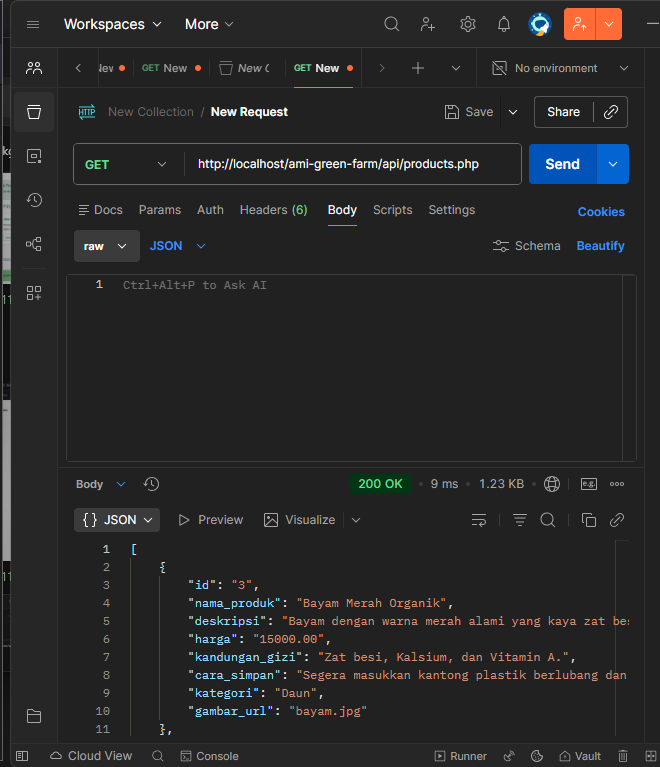
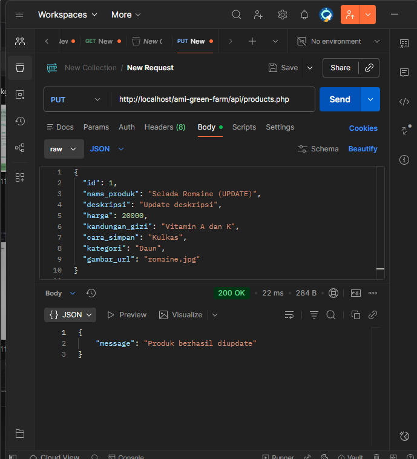
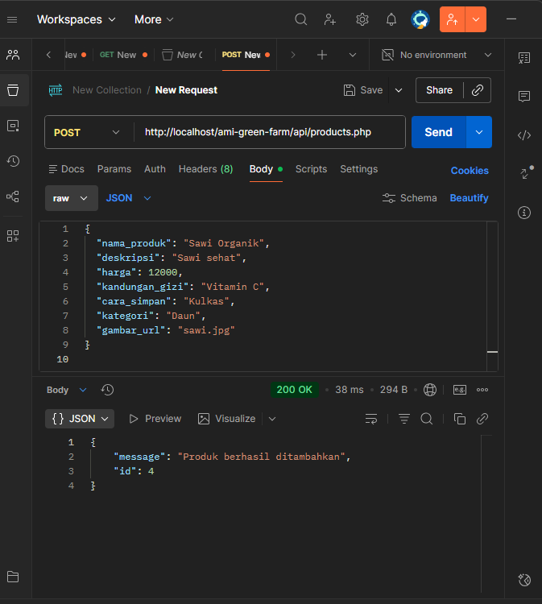
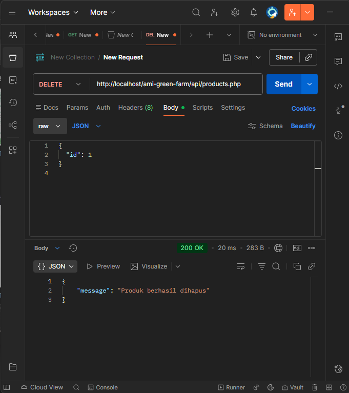

# AMI-GREEN-FARM

## Deskripsi
Proyek ini adalah website dan API untuk **Ami Green Farm**, dibuat sebagai Ujian Tengah Semester Pemrograman Web 1.  
Website memiliki fitur:  
- Halaman Utama (Informasi perusahaan)
- Halaman Detail Informasi
- Halaman Login & Registrasi
- Halaman Dashboard/Menu Utama setelah Login

API mendukung CRUD untuk produk dan user.

## Teknologi
- HTML, CSS (Bootstrap)
- JavaScript
- PHP
- MySQL

## Cara Menjalankan
1. Copy folder `ami-green-farm` ke `htdocs` XAMPP.
2. Jalankan XAMPP, aktifkan **Apache** dan **MySQL**.
3. Import database (jika ada file SQL) ke phpMyAdmin.
4. Akses melalui browser: `http://localhost/ami-green-farm/`

## Screenshot

### Halaman Get

### Halaman put

### Halaman post

### Halaman delete

## Author
- Fahmi Fauziah Nur Fadillah  
- NPM: 23552011314  
- Kelas: TIF RP 23 CNS A
